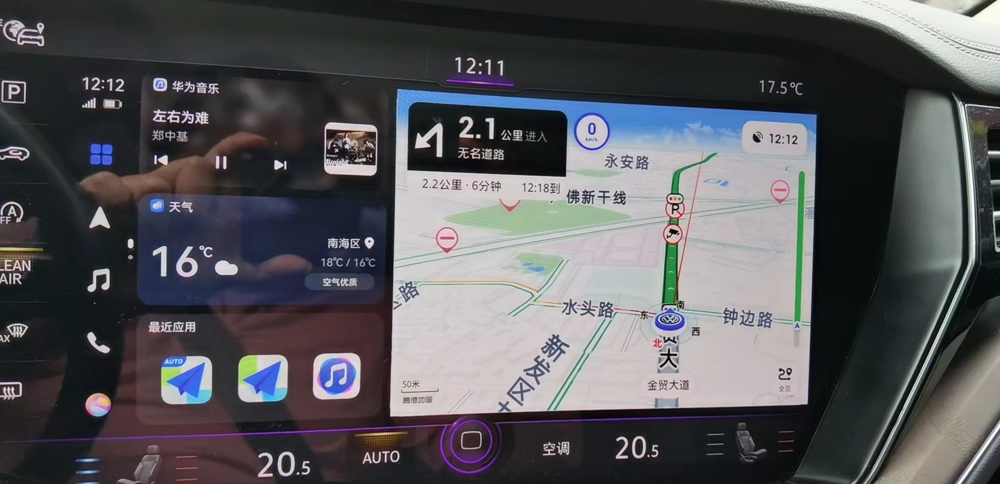
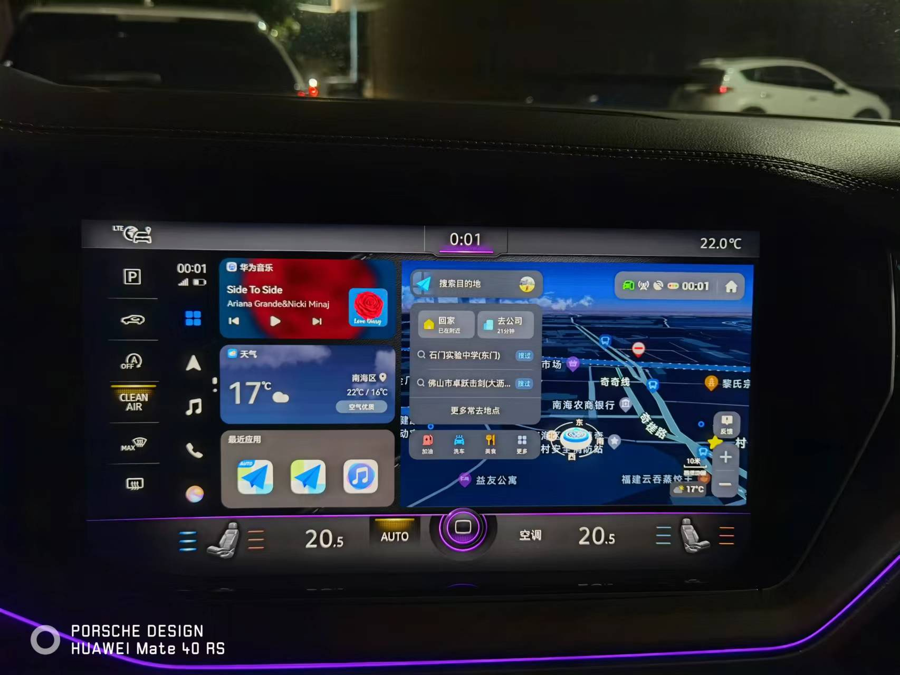
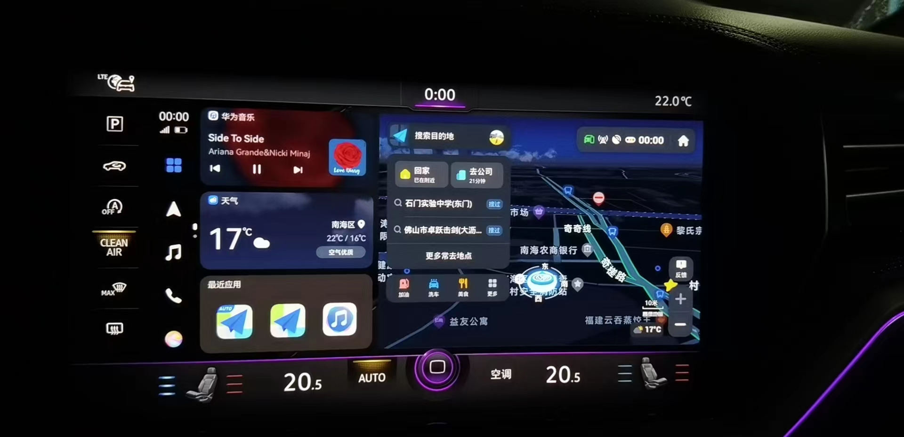

# AutoNaviHicar
高德地图车机版 hicar

支持hicar小窗

`待支持`

 * [ ] 默认首页
 * [ ] 语音操作
 * [ ] 支持其他版本

`注意事项:`

 1.不支持语音;

 2.目前只支持hicar414版本

Tip：该软件为官方未经授权修改软件，仅个人试用体验，任何个人及团体下载本软件后不得用于商业用途及其它用途，软件版权归高德地图公司所有

`介意勿下。。。`
__纯属自娱自乐，使用中如遇任何问题或因此软件遭受任何损失与本人、高德及hicar无关，请按需下载使用__

`技术讨论群`

`部分效果图`

